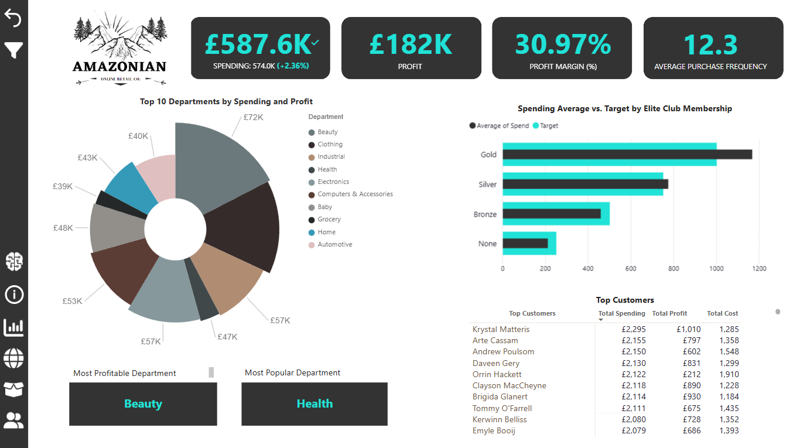
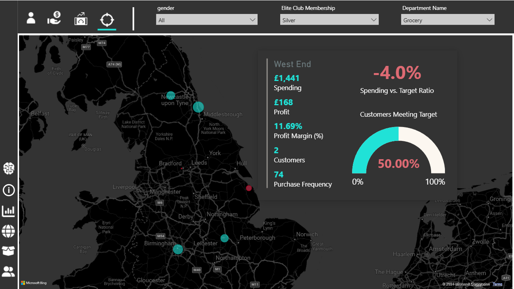
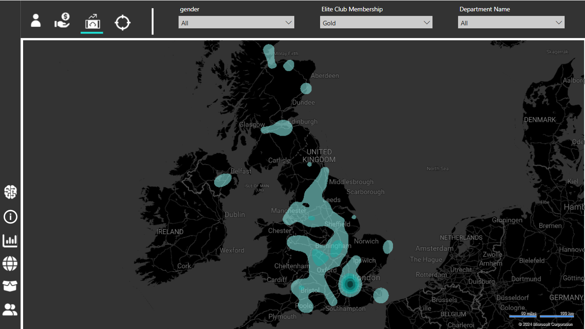
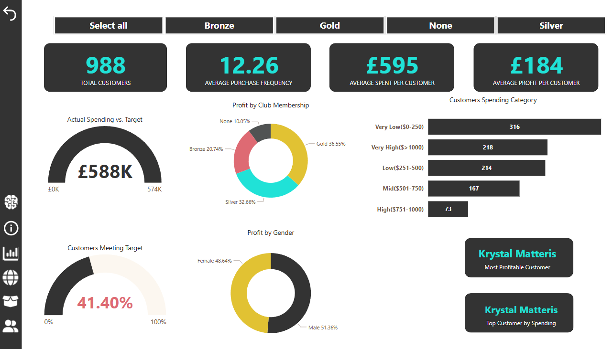
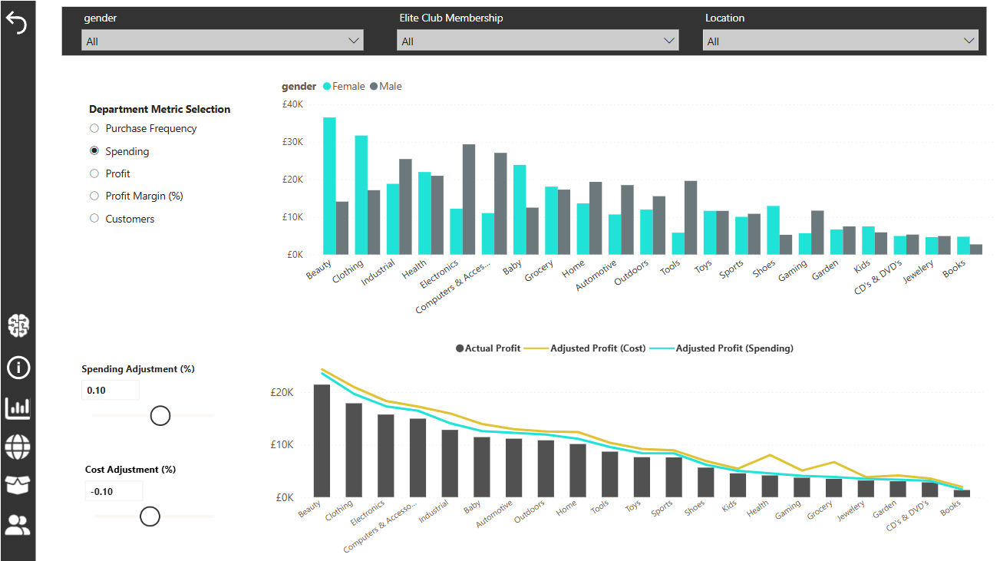

# Amazonian Retail Insights: Customer Segmentation and Sales Visualisation

## Overview
In this project, I embarked on a data-driven journey to uncover hidden patterns and trends within Amazonian's customer base. Leveraging Power BI and advanced Excel techniques, I aimed to enhance Amazonian's understanding of customer behaviours and optimise product offerings.

## Dashboard Preview
Here is an overview of the interactive dashboard created for this project:

## Data Source and Preparation
A snapshot of customer data was provided, encompassing demographics, purchasing behaviour, and membership details. I meticulously transformed this raw data using advanced Excel functions and crafted a robust data model in Power BI. This foundation ensured high data quality and enabled actionable insights.

## Key Components
### 1. Customer Segmentation Analysis
- Techniques Used: Applied advanced analytics to identify distinct customer segments based on geography, spending habits, and membership status.
- Outcome: Uncovered significant variations in customer spending and loyalty across different regions and membership tiers.

### 2. Sales Analysis
- Approach: Provided a comprehensive view of sales performance across various regions and product categories.
- Findings: Identified profitability hotspots where certain geographic areas and product categories drive disproportionate profit margins.

### 3. Membership Optimisation
- Strategy: Analysed membership structures to improve customer loyalty and retention.
- Result: Recommended adjustments to membership offerings based on data insights.

### 4. Profit Impact of Cost and Spending Adjustments
- Approach: Applied equal percentage adjustments to spending increase and cost decrease (e.g., 10% each).
- Findings: Profit increases from cost reduction were significantly higher than from spending increases, especially in the health and grocery departments.
- Outcome: Highlighted that these departments suffer from either excessively high costs or low profit margins.

## Dashboard Design
I constructed a dynamic and interactive dashboard in Power BI that empowers decision-makers to:
- Visualise Customer Segments: Explore customer profiles based on various dimensions.
- Identify High-Value Customers: Uncover customers with the highest lifetime value and profit margins.
- Benchmark Performance Against KPIs: Track progress towards average spending goals for different customer segments.

## Analysis and Findings
My analysis revealed compelling insights into customer behaviour and performance:
- Distinct Customer Segments: Spending and loyalty vary significantly by region and membership tier.
- Profitability Hotspots: Certain areas and product categories contribute disproportionately to profits.
- Growth Opportunities: Identified untapped customer segments and underperforming product categories for strategic initiatives.

## Recommendations
- Targeted Marketing and Retention Strategies: Recommended tailored campaigns focusing on high-value customers and regions with potential. Prioritise retention in departments with low membership rates.
- Profitability Optimisation: Dive deeper into low-margin departments to find cost-saving or revenue-enhancing opportunities. Consider adjusting pricing or product assortment.
- Product Alignment: Adjust product offerings to meet regional preferences and membership needs.

## Skills Highlighted
- Data Analysis and Visualisation: Utilised Power BI and Excel to transform raw data into actionable insights.
- Customer Segmentation: Applied advanced analytics techniques to identify distinct customer groups.
- Dashboard Design: Created user-friendly and informative dashboards to facilitate data-driven decision-making.

## Limitations
While the analysis yielded valuable insights, it's important to acknowledge the limitations imposed by the single-day dataset. Time series analysis, a powerful tool for identifying trends and forecasting, was unfortunately beyond the scope.

## Conclusion
Despite these constraints, this project successfully transformed raw data into actionable intelligence, demonstrating the potential of data visualisation to drive business growth. It provided a roadmap for future data-driven initiatives, showcasing the pivotal role of analytics in enhancing customer satisfaction and driving success.

---

## Files in the Repository:
-**`Amazonian.pbix`**: The complete Power BI file that contains the full visualisation, including data preprocessing, modeling, and dashboards.
-**`dataset/`**: The folder containing the raw Amazonian data.
-**`images/`**: Contains various dashboard images.
